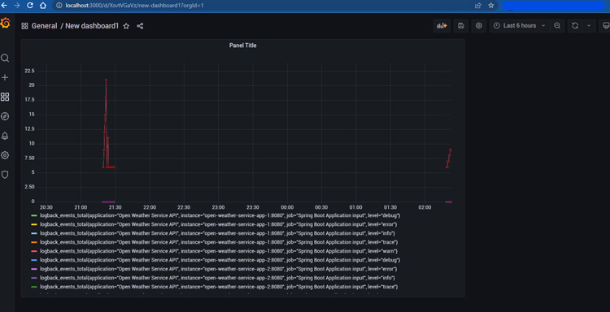

# Open Weather Service Application

---
### Overall Architecture


### The service provides an API
#### `WeatherAPI`
* To search current weather report by city name.


### How does the application works?
* Application receives the requested via `/v1/api/open-weather/{city}` url with `{city}` path variables
* There is a validation for city parameter. City value can not be decimal or a blank value. 
  * If the city value is not valid, api returns `400 - Http Bad Request` response
* Current weather report can be fetch either from database or WeatherStackAPI with the API_KEY
  * If the latest data is not older than 30 minutes for that city value, data is fetching from db.
  * Either city does not exist or older than 30 minutes in DB, a request sends to WeatherStackAPI and the result puts to Cache
  * If there is a value with city filter as key in cache, the response is returns from cache directly

On the swagger page you can find the relevant api endpoint. 
You can reach the openapi page by `http://localhost:8080/swagger-ui/index.html` url.

You can define <b>WEATHER_STACK_API_KEY </b> in the `.env` file

## Technologies

---
- Java 17
- Spring Boot 3.0
- Open API Documentation
- Spring Data JPA
- Kotlin
- H2 In Memory Database
- Restful API
- Maven
- Junit5
- Mockito
- Integration Tests
- Docker
- Docker Compose
- Github Actions
- Prometheus
- Grafana


## Prerequisites

---
- Maven or Docker
---

## Docker Run
The application can be built and run by the `Docker` engine. The `Dockerfile` has multistage build, so you do not need to build and run separately.

Please follow the below directions in order to build and run the application with Docker Compose;

```sh
$ cd warehouse-software-assignment
$ docker-compose up -d
```

Docker compose creates 3 replicas (instances) of the application on port range 9595-9597

#### You can reach the open-api-ui via  `http://{HOST}:{9595-9597}/swagger-ui.html`
### Prometheus
#### You can reach prometheus page via `http://{HOST}:9090`
 
### Grafana
#### You can reach grafana page via `http://{HOST}:3000` - GF_SECURITY_ADMIN_PASSWORD=admin


---
## Maven Run
To build and run the application with `Maven`, please follow the directions below;

```sh
$ cd warehouse-software-assignment
$ mvn clean install
$ mvn spring-boot:run
```
You can reach the swagger-ui via  `http://{HOST}:8080/swagger-ui.html`

---